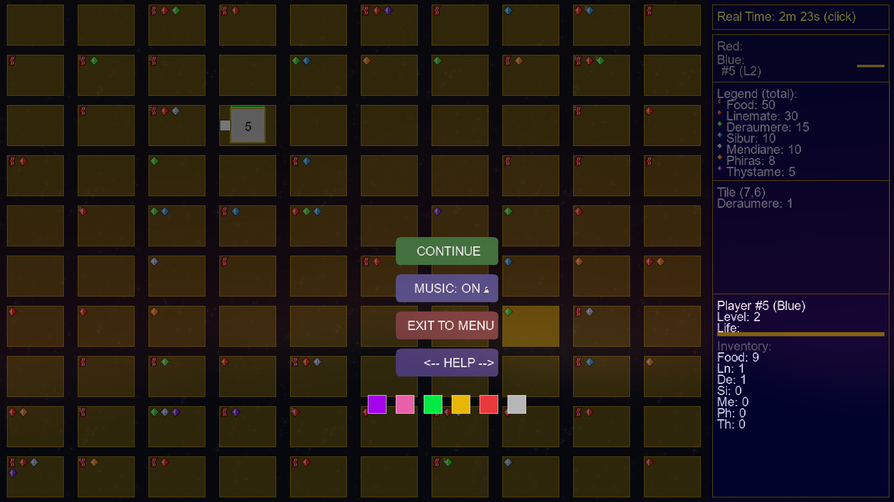

# Zappy: A Multiplayer Network Game Simulator

Welcome to the Zappy project, a multiplayer simulation game developed as part of our second-year curriculum at EPITECH. This project aims to create an interactive, network-based ecosystem where strategy and coordination are crucial for victory.

## Table of Contents

- [About Zappy](#about-zappy)
- [Features](#features)
- [Project Structure](#project-structure)
- [Getting Started](#getting-started)
  - [Compilation](#compilation)
  - [Running the Server](#running-the-server)
  - [Connecting the Graphical User Interface (GUI)](#connecting-the-graphical-user-interface-gui)
  - [Running the AI Client](#running-the-ai-client)
- [Game Mechanics](#game-mechanics)
  - [World Geography](#world-geography)
  - [Resources](#resources)
  - [Players (Trantorians)](#players-trantorians)
  - [Elevation Ritual](#elevation-ritual)
  - [Vision](#vision)
  - [Sound Transmission](#sound-transmission)
- [Commands](#commands)
- [Communication Protocol](#communication-protocol)
- [Examples and Screenshots](#exemple-and-screenshots)
- [Team and Development Process](#team-and-development-process)
- [Memory Management](#memory-management)
- [Result of the project](#result-of-the-project)
- [Credits](#credits)
- [License](#license)

## About Zappy

Zappy is a network game where multiple teams compete on a tile map containing various resources. The main objective is to guide a team of at least six players to reach the maximum elevation level, requiring significant cooperation, planning, and efficient execution.

The project is divided into three interconnected components:
* **Server**: The central system governing game mechanics, player movements, resource management, and communication protocols. Developed in C.
* **Graphical User Interface (GUI)**: A visual tool that displays the real-time state of the server, allowing observers to follow the game's progression dynamically. Developed in C++.
* **Artificial Intelligence (AI)**: Autonomous players that analyze the game environment and make strategic decisions to evolve efficiently. The AI client has no language constraint.

This project offered a valuable opportunity to deepen our understanding of network communication, software architecture, and teamwork in a large-scale project setting.

## Features

### Server
* **Event-Driven System**: Uses `poll()` for socket multiplexing.
* **Single Process, Single Thread**: Optimized for efficiency.
* **Spherical Topology**: World edges wrap around (e.g., exit right, re-enter left).
* **Resource Management**: Spawns resources every 20 time units according to a specific density formula.
* **Command Queue System**: Players can queue up to 10 commands before the server blocks; commands are executed asynchronously based on their time cost.
* **Time Management**: Uses millisecond precision and frequency scaling for action execution times.
* **Incantation System**: Manages complex elevation rituals with pre- and post-validation checks.
* **Player Reproduction**: Supports the `fork` command to create new eggs and team slots.

### Graphical User Interface (GUI)
* **Real-time Visualization**: Provides a dynamic representation of the game world.
* **SDL2 Based**: Built with SDL2 for graphics, SDL2_mixer for audio, SDL2_ttf for text, and SDL2_image for asset loading.
* **Optimized Rendering**: Includes VSync support, text batching, viewport optimization, and texture caching.
* **Audio System**: Event-driven sound effects for game events and background music with volume controls.
* **Interactive Features**: Mouse interactions for tile inspection and keyboard controls for navigation and theme switching.
* **Visual Effects**: Particle effects for incantations and level-ups, smooth animations, and player movement interpolation.
* **Theme System**: Multiple visual themes with real-time switching.
* **Help System**: Multi-page help screens with contextual information.
* **User Interface Design**: Responsive layout, adaptive scaling, and dynamic text sizing.

### Artificial Intelligence (AI) Client
* **State Machine Architecture**: Uses primary states such as EXPLORING, GATHERING, FORAGING, and LEVELING_UP for intelligent decision-making.
* **Survival Intelligence**: Monitors food stock, prioritizes emergency foraging, and manages inventory.
* **Team Coordination**: Secure messaging, level-specific incantation calls, and directional navigation to teammates.
* **Strategic Resource Management**: Gathers only necessary stones for the next level, calculates exact deficits, and prepares incantation sites.
* **Advanced Movement Intelligence**: Vision-based navigation, multi-step pathfinding, and collision avoidance.
* **Robust Network Communication**: Handles timeouts, detects player death, and queues broadcast messages.
* **Priority System**: Defines a hierarchy for actions, prioritizing survival, team coordination, reproduction, elevation, resource gathering, and exploration.

## Project Structure

The project includes three main executables:
* `zappy_server`: The game server.
* `zappy_gui`: The graphical client.
* `zappy_ai`: The AI client.

Your Makefile should contain `zappy_server`, `zappy_gui`, and `zappy_ai` rules to compile these executables.

## Getting Started

### Compilation

To compile the project, navigate to the root directory and use the `make` command with the desired target:

```bash
make zappy_server   # Compiles the C server
make zappy_gui      # Compiles the C++ GUI
make zappy_ai       # Compiles the AI client (Python wrapper)
make                # Compiles all components
```

### Running the Server

The server generates the game world and manages inhabitants.
```bash
./zappy_server -p <port> -x <width> -y <height> -n <team_name1> <team_name2>... -c <clients_nb> -f <freq>
```

**Parameters:**
* `-p port`: Network port for client connections.
* `-x width`: World map width (in tiles).
* `-y height`: World map height (in tiles).
* `-n team_name1 team_name2...`: Names of the teams (space-separated).
* `-c clients_nb`: Maximum number of authorized clients per team.
* `-f freq`: Reciprocal of the time unit for action execution (default: 100).

**Example:**
```bash
./zappy_server -p 4242 -x 10 -y 10 -n Gryffindor Slytherin -c 5 -f 100
```

### Connecting the Graphical User Interface (GUI)

The graphical client is used to observe the game world. The GUI authenticates itself to the server by sending "GRAPHIC" when prompted for a team name.

```bash
./zappy_gui -p <port> -h <machine>
```

**Parameters:**
* `-p port`: Server port to connect to.
* `-h machine`: Hostname of the server (default: `localhost`).

**Example:**
```bash
./zappy_gui -p 4242 -h localhost
```

### Running the AI Client

The AI client controls an inhabitant through orders sent to the server.

```bash
./zappy_ai -p <port> -n <team_name> -h <machine>
```

**Parameters:**
* `-p port`: Server port to connect to.
* `-n team_name`: Name of the team to join.
* `-h machine`: Name of the machine (default: `localhost`).

**Example:**
```bash
./zappy_ai -p 4242 -n Gryffindor -h localhost
```

## Game Mechanics

### World Geography

The game world, called Trantor, consists of zero-relief planes, representing a world map. The map has a spherical topology, meaning if a player exits one side, they reappear on the opposite side.

### Resources

Trantor is rich in resources, including succulent food and six distinct categories of natural stones:
* Linemate
* Deraumere
* Sibur
* Mendiane
* Phiras
* Thystame

Resources appear upon server start and every 20 time units, spread evenly across the map. The quantity of resources is calculated by `map_width * map_height * density`.

| Resource   | Density |
|------------|---------|
| food       | 0.5     |
| linemate   | 0.3     |
| deraumere  | 0.15    |
| sibur      | 0.1     |
| mendiane   | 0.1     |
| phiras     | 0.08    |
| thystame   | 0.05    |


For example, on a 10x10 world, there will be 50 food and 5 thystame.

### Players (Trantorians)

Trantor's inhabitants are bodiless, blurry, pacifist creatures that occupy an entire tile. Their main activities involve feeding themselves and collecting stones. They can see as far as their visual capacities allow and need food to survive. One unit of food allows them to live for 126 time units.

At the beginning of the game, each player has 10 life units, equivalent to 1260 time units or $1260/f$ seconds.

### Elevation Ritual

The goal for Trantorians is to ascend in hierarchy through an "elevation ritual". This ritual requires gathering a certain number of stones and a specific number of players of the *same level* on the same tile.

The ritual begins when a player initiates the incantation. All participating players are frozen during the ritual and cannot perform other actions. If the conditions are not met at the beginning or end of the action, the elevation fails. Upon success, all participating players attain the higher level, and the stones are removed from the terrain.

The requirements for elevation are:

| Elevation | Players | Linemate | Deraumere | Sibur | Mendiane | Phiras | Thystame |
|-----------|---------|----------|-----------|-------|----------|--------|----------|
| 1->2      | 1       | 1        | 0         | 0     | 0        | 0      | 0        |
| 2->3      | 2       | 1        | 1         | 1     | 0        | 0      | 0        |
| 3->4      | 2       | 2        | 0         | 1     | 0        | 2      | 0        |
| 4->5      | 4       | 1        | 1         | 2     | 0        | 1      | 0        |
| 5->6      | 4       | 1        | 2         | 1     | 3        | 0      | 0        |
| 6->7      | 6       | 1        | 2         | 3     | 0        | 1      | 0        |
| 7->8      | 6       | 2        | 2         | 2     | 2        | 2      | 1        |

### Vision

Players have a limited field of vision. With each elevation, their vision increases by one unit in front and one on each side of the new line. At level 1, the unit is defined as 1.

The `Look` command returns a string representing visible tiles and their contents, such as `[player, object-on-tile1, object-on-tileP,...]`.

### Sound Transmission

Sound propagates linearly via broadcasting. All players can hear broadcasts without knowing the emitter, perceiving only the direction and message. The direction is indicated by a tile number (0 for the emitter's tile, 1 for the tile directly in front, and so on, encircling the player trigonometrically). The shortest path for sound is always chosen in the spherical world.

## Commands

Players can perform the following actions by sending commands to the server:

| Action                                | Command               | Time Limit | Response                        | Description                                     |
|---------------------------------------|-----------------------|------------|---------------------------------|-------------------------------------------------|
| Move up one tile                      | `Forward`             | $7/f$        | `ok`                            | Moves player in current direction.              |
| Turn $90^{\circ}$ right               | `Right`               | $7/f$        | `ok`                            | Changes player orientation clockwise.           |
| Turn $90^{\circ}$ left                | `Left`                | $7/f$        | `ok`                            | Changes player orientation counter-clockwise.   |
| Look around                           | `Look`                | $7/f$        | `[tile1, tile2,...]`            | Returns vision field contents.                  |
| Inventory                             | `Inventory`           | $1/f$        | `[linemate n, sibur n....]`     | Lists player's inventory and remaining life.    |
| Broadcast text                        | `Broadcast text`      | $7/f$        | `ok`                            | Broadcasts text to all players.                 |
| Number of unused team slots           | `Connect_nbr`         | -            | `value`                         | Returns available team connection slots.        |
| Fork a player                         | `Fork`                | $42/f$       | `ok`                            | Spawns a new egg and team slot.                 |
| Eject players from this tile          | `Eject`               | $7/f$        | `ok/ko`                         | Pushes other players from the current tile.     |
| Take object                           | `Take object`         | $7/f$        | `ok/ko`                         | Collects item from current tile.                |
| Set object down                       | `Set object`          | $7/f$        | `ok/ko`                         | Places item on current tile.                    |
| Start incantation                     | `Incantation`         | $300/f$      | `Elevation underway` / `Current level: k` / `ko` | Attempts an elevation ritual.                   |
| Player death                          | (N/A)                 | (N/A)        | `dead`                          | Indicates player death.                         |

All commands must end with a newline. If a command is invalid or unknown, the server responds with "ko".

## Communication Protocol

Communication between the AI client and the server occurs via TCP sockets. The server uses `poll` for socket multiplexing.

The client connection process is as follows:
1.  The client opens a socket on the server's port.
2.  The server sends `WELCOME\n`.
3.  The client sends `TEAM-NAME\n`.
4.  The server sends `CLIENT-NUM\n` (number of available slots) and `X Y\n` (world dimensions).

The client can send up to 10 consecutive requests without waiting for a server response. Beyond 10, the server will ignore them. Requests are buffered and executed in the order received; command execution time only blocks the specific player.

The GUI uses a specific protocol for communication with the server, documented in `B-YEP-400_zappy_GUI_protocol.pdf`.

## Examples and Screenshots

Here are some visual examples of the Zappy game in action, showcasing the GUI and gameplay elements.

### Principal Menu


### Gameplay Overview


### Pause Menu



### AI Client in Action


## Team and Development Process

This project was developed by a group of five students:
* Louis FIHOL-VALANTIN
* Ethan BRANCHEREAU
* Lilyan BOUYER
* Thea GORY-LAURET
* Yanis BEN SAID

To ensure smooth progress, a lead person was assigned to each of the three main components (Server, GUI, AI), with the remaining two members designated as "supporters" to assist where needed. Time management was structured using a GitHub Project board for task breakdown, progress tracking, and prioritization. A dedicated Discord server facilitated quick communication, push notifications, and issue resolution.

## Result of the project

### Total score : 60.5 / 73 (Best score in the promo)

| Category                          | Score     | Comments                                                                    |
|-----------------------------------|-----------|-----------------------------------------------------------------------------|
| Preliminary                       | 2 / 2     |                                                                             |
| Coding style                      | 0 / 0     |                                                                             |
| [CORE] Run forever                | 1 / 1     |                                                                             |
| [NTW] Poll usage                  | 1 / 1     |                                                                             |
| [NTW] Buffers                     | 3 / 4     |                                                                             |
| [NTW] Network Buffer Tests        | 1 / 1.5   |                                                                             |
| [NTW] Network Load Tests          | 4 / 4     |                                                                             |
| [ARCHI] Layered architecture      | 2 / 3     |                                                                             |
| [ARCHI] Error management          | 2 / 3     |                                                                             |
| [FUN] Params                      | 1.5 / 2   |                                                                             |
| [FUN] AI Protocol                 | 3 / 3     |                                                                             |
| [FUN] GUI Protocol                | 0 / 3     |                                                                             |
| [FUN] Time                        | 2 / 2     |                                                                             |
| [PRELI] Is there a GUI?           | 1 / 1     |                                                                             |
| [NTW] Buffer / poll               | 2 / 2     |                                                                             |
| [GUI] Render                      | 4 / 4     | Pas en 3D mais la qualité de rendu vaut un 4                                |
| [GUI] Displayed informations      | 4 / 4     |                                                                             |
| [GUI] Real-time Display           | 4 / 4     |                                                                             |
| [GUI] Interactions                | 5 / 6     |                                                                             |
| [FUN] Protocol                    | 2 / 3     |                                                                             |
| [ARCHI] Encapsulation & abstraction | 1 / 5     |                                                                             |
| [ARCHI] Separation of concerns    | 3 / 3     | EventDispatcher                                                             |
| [PRELI] Is there AI?              | 1 / 1     |                                                                             |
| [NTW] Buffer / poll               | 2 / 2     |                                                                             |
| [FUN] Algo                        | 2 / 3     |                                                                             |
| [FUN] Communication               | 2 / 4     |                                                                             |
| [FUN] Level                       | 5 / 8     |                                                                             |
| [FUN] Auto fork                   | 0 / 1     |                                                                             |

## Memory Management

The server has been validated with Valgrind and shows zero memory leaks, ensuring clean memory management across all components.

## Credits

This project was developed at EPITECH.
